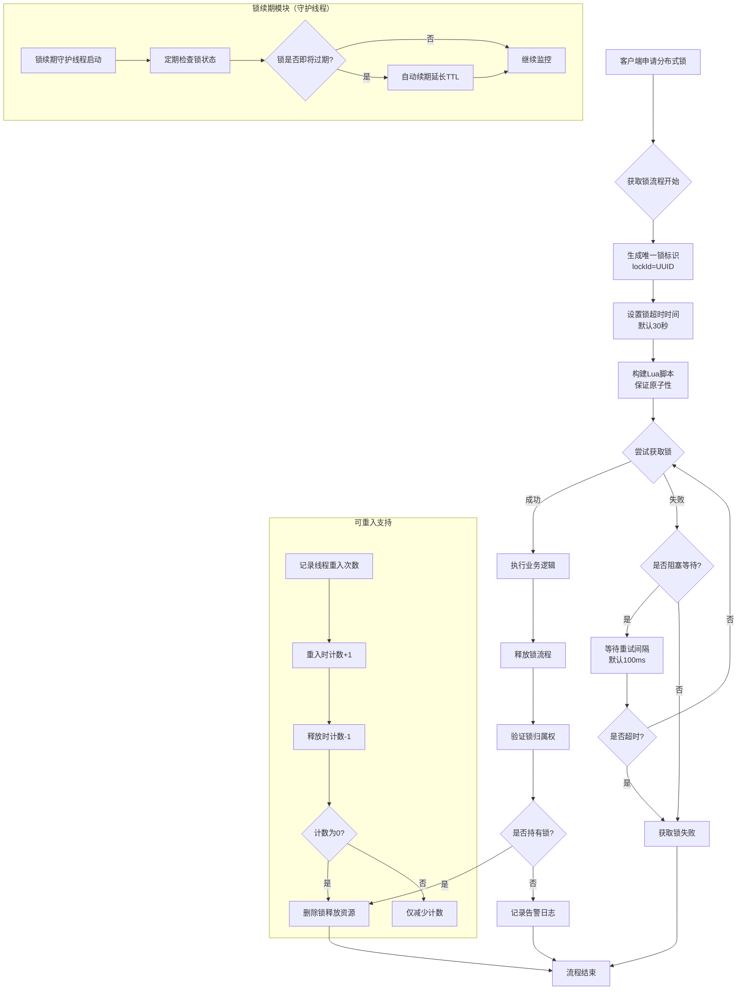

## 分布式锁详解

### 一、什么是分布式锁
分布式锁是在分布式系统中协调多个节点对共享资源访问的一种同步机制。当多个进程/服务需要互斥地访问共享资源时，通过分布式锁来保证同一时刻只有一个节点可以执行关键代码段。

### 二、为什么需要分布式锁

**典型应用场景：**
1. **避免重复操作**：如订单重复提交
2. **库存扣减**：防止超卖
3. **秒杀系统**：控制并发流量
4. **分布式任务调度**：确保任务只被执行一次
5. **配置更新**：防止并发更新配置

### 三、分布式锁的核心特性

#### 1. 基本要求
- **互斥性**：同一时刻只有一个客户端能持有锁
- **安全性**：不会发生死锁，即使持有锁的客户端崩溃
- **容错性**：只要大部分Redis节点存活，客户端就能获取和释放锁

#### 2. 高级要求
- **可重入性**：同一客户端可多次获取同一把锁
- **超时机制**：避免死锁，自动释放
- **非阻塞**：尝试获取锁失败立即返回
- **公平性**：按申请顺序获得锁（可选）

### 四、常见实现方案对比

#### 1. **基于Redis的实现**（最常用）
```python
# 使用Redlock算法示例
import redis
import uuid
import time

class RedisDistributedLock:
    def __init__(self, redis_nodes):
        self.redis_nodes = redis_nodes
        self.lock_key = "resource_lock"
        self.lock_value = str(uuid.uuid4())
        self.expire_time = 30  # 秒
        
    def acquire(self):
        # 尝试在多数节点上获取锁
        acquired_count = 0
        start_time = time.time()
        
        while time.time() - start_time < 0.1:  # 获取锁的超时时间
            for redis_client in self.redis_nodes:
                if redis_client.set(self.lock_key, self.lock_value, 
                                  nx=True, ex=self.expire_time):
                    acquired_count += 1
            
            # 检查是否在多数节点上获得锁
            if acquired_count > len(self.redis_nodes) / 2:
                return True
                
            # 释放已获得的锁
            self._release_partial()
            time.sleep(0.01)
            
        return False
    
    def release(self):
        # 使用Lua脚本保证原子性
        lua_script = """
        if redis.call("get", KEYS[1]) == ARGV[1] then
            return redis.call("del", KEYS[1])
        else
            return 0
        end
        """
        for redis_client in self.redis_nodes:
            redis_client.eval(lua_script, 1, self.lock_key, self.lock_value)
```

#### 2. **基于ZooKeeper的实现**
```java
public class ZooKeeperLock {
    private ZooKeeper zk;
    private String lockPath;
    private String currentPath;
    
    public boolean tryLock() {
        // 创建临时顺序节点
        currentPath = zk.create(lockPath + "/lock-", 
                               new byte[0], 
                               ZooDefs.Ids.OPEN_ACL_UNSAFE,
                               CreateMode.EPHEMERAL_SEQUENTIAL);
        
        // 检查是否是最小序号节点
        List<String> children = zk.getChildren(lockPath, false);
        Collections.sort(children);
        
        if (currentPath.equals(lockPath + "/" + children.get(0))) {
            return true; // 获得锁
        }
        
        // 监听前一个节点
        String previousNode = children.get(Collections.binarySearch(children, 
            currentPath.substring(currentPath.lastIndexOf("/") + 1)) - 1);
        
        CountDownLatch latch = new CountDownLatch(1);
        zk.exists(lockPath + "/" + previousNode, 
                 event -> {
                     if (event.getType() == EventType.NodeDeleted) {
                         latch.countDown();
                     }
                 });
        
        return latch.await(10, TimeUnit.SECONDS);
    }
}
```

#### 3. **基于数据库的实现**
```sql
-- 基于唯一索引
CREATE TABLE distributed_lock (
    id INT PRIMARY KEY AUTO_INCREMENT,
    lock_name VARCHAR(100) UNIQUE,
    holder_id VARCHAR(100),
    expire_time TIMESTAMP,
    version INT DEFAULT 0
);

-- 获取锁
INSERT INTO distributed_lock (lock_name, holder_id, expire_time) 
VALUES ('order_lock', 'client_001', DATE_ADD(NOW(), INTERVAL 30 SECOND))
ON DUPLICATE KEY UPDATE 
    holder_id = IF(expire_time < NOW(), VALUES(holder_id), holder_id),
    expire_time = IF(expire_time < NOW(), VALUES(expire_time), expire_time);
```

### 五、Redlock算法详解

#### 算法步骤：
1. **获取当前时间**（毫秒精度）
2. **依次向N个Redis节点请求锁**
   - 使用相同的key和随机值
   - 设置超时时间（远小于锁失效时间）
3. **计算获取锁耗时**
   - 当前时间减去步骤1的时间
   - 锁的有效时间 = 设置失效时间 - 获取锁耗时
4. **验证锁**
   - 仅在多数节点上获得锁（N/2+1）
   - 锁的有效时间大于0
5. **释放锁**
   - 向所有节点发送删除请求

### 六、最佳实践与注意事项

#### 1. **锁的粒度控制**
```python
# 粗粒度锁 - 影响性能
lock_key = "global_order_lock"

# 细粒度锁 - 提高并发
lock_key = f"order_lock_{order_id}"
```

#### 2. **避免常见陷阱**
```python
# ❌ 错误：非原子操作
def unsafe_release(redis_client, lock_key):
    if redis_client.get(lock_key) == my_id:
        redis_client.delete(lock_key)  # 非原子，可能删除其他客户端的锁

# ✅ 正确：使用Lua脚本保证原子性
release_script = """
if redis.call("get", KEYS[1]) == ARGV[1] then
    return redis.call("del", KEYS[1])
else
    return 0
end
"""
```

#### 3. **锁续期机制**
```python
class LockWithRenewal:
    def __init__(self):
        self.renew_thread = None
        self.stop_renew = False
        
    def start_renewal(self, lock_key, lock_value, ttl):
        def renew():
            while not self.stop_renew:
                time.sleep(ttl / 3)  # 每1/3 TTL时间续期一次
                redis_client.expire(lock_key, ttl)
        
        self.renew_thread = threading.Thread(target=renew)
        self.renew_thread.start()
```

### 七、各方案对比

| 特性       | Redis          | ZooKeeper | 数据库     |
| ---------- | -------------- | --------- | ---------- |
| 性能       | 高             | 中        | 低         |
| 实现复杂度 | 中             | 高        | 低         |
| 可靠性     | 中（依赖集群） | 高        | 高         |
| 可重入性   | 需额外实现     | 原生支持  | 需额外实现 |
| 公平性     | 需额外实现     | 原生支持  | 无         |
| 读写锁     | 需额外实现     | 原生支持  | 无         |

### 八、现代分布式锁方案

#### 1. **etcd分布式锁**
```go
// 使用etcd的lease机制
resp, err := client.Grant(context.Background(), 10) // 10秒租约
_, err = client.Put(context.Background(), "lock_key", "value", clientv3.WithLease(resp.ID))

// 自动续约
keepAlive, err := client.KeepAlive(context.Background(), resp.ID)
```

#### 2. **Consul分布式锁**
```go
lock, err := consul.LockKey("service/lock")
if err != nil {
    log.Fatal(err)
}

// 获取锁
stopCh := make(chan struct{})
lock.Lock(stopCh)

// 执行业务逻辑
defer lock.Unlock()
```

### 九、选择建议

1. **追求性能** → Redis（需实现完整机制）
2. **需要强一致性** → ZooKeeper/etcd
3. **简单场景** → 数据库实现
4. **云环境** → 使用云服务商提供的分布式锁（如AWS ElastiCache、Azure Cache）

### 十、监控与调试

```python
class MonitoredDistributedLock:
    def __init__(self):
        self.metrics = {
            'lock_success': 0,
            'lock_failure': 0,
            'lock_wait_time': [],
            'hold_time': []
        }
    
    def acquire_with_monitor(self):
        start = time.time()
        success = self.acquire()
        wait_time = time.time() - start
        
        if success:
            self.metrics['lock_success'] += 1
            self.metrics['lock_wait_time'].append(wait_time)
        else:
            self.metrics['lock_failure'] += 1
            
        return success
```

分布式锁的正确实现需要综合考虑**性能、可靠性、容错性**，根据具体业务场景选择最合适的方案，并充分考虑网络分区、时钟漂移等分布式环境下的特殊情况。

# 基于Redis的Java分布式锁详细实现

## 一、整体架构与流程图



## 二、完整Java实现代码

### 1. 锁信息实体类

```java
import java.io.Serializable;
import java.time.LocalDateTime;

/**
 * 分布式锁信息实体
 */
public class LockInfo implements Serializable {
    private static final long serialVersionUID = 1L;
    
    // 锁的唯一标识
    private String lockId;
    
    // 锁的键名
    private String lockKey;
    
    // 锁的值（客户端唯一标识）
    private String lockValue;
    
    // 持有锁的线程ID
    private long threadId;
    
    // 持有锁的JVM进程ID
    private String jvmId;
    
    // 获取锁的时间
    private LocalDateTime acquireTime;
    
    // 锁的过期时间
    private LocalDateTime expireTime;
    
    // 重入次数
    private int reentrantCount = 1;
    
    // 业务标识（可选）
    private String businessKey;
    
    public LockInfo() {}
    
    public LockInfo(String lockKey, String lockValue, long timeoutSeconds) {
        this.lockKey = lockKey;
        this.lockValue = lockValue;
        this.lockId = java.util.UUID.randomUUID().toString();
        this.threadId = Thread.currentThread().getId();
        this.jvmId = getJvmId();
        this.acquireTime = LocalDateTime.now();
        this.expireTime = this.acquireTime.plusSeconds(timeoutSeconds);
    }
    
    private String getJvmId() {
        try {
            return java.lang.management.ManagementFactory.getRuntimeMXBean().getName();
        } catch (Exception e) {
            return "unknown-jvm";
        }
    }
    
    // Getter和Setter方法
    public String getLockId() { return lockId; }
    public void setLockId(String lockId) { this.lockId = lockId; }
    
    public String getLockKey() { return lockKey; }
    public void setLockKey(String lockKey) { this.lockKey = lockKey; }
    
    public String getLockValue() { return lockValue; }
    public void setLockValue(String lockValue) { this.lockValue = lockValue; }
    
    public long getThreadId() { return threadId; }
    public void setThreadId(long threadId) { this.threadId = threadId; }
    
    public String getJvmId() { return jvmId; }
    public void setJvmId(String jvmId) { this.jvmId = jvmId; }
    
    public LocalDateTime getAcquireTime() { return acquireTime; }
    public void setAcquireTime(LocalDateTime acquireTime) { this.acquireTime = acquireTime; }
    
    public LocalDateTime getExpireTime() { return expireTime; }
    public void setExpireTime(LocalDateTime expireTime) { this.expireTime = expireTime; }
    
    public int getReentrantCount() { return reentrantCount; }
    public void setReentrantCount(int reentrantCount) { this.reentrantCount = reentrantCount; }
    
    public String getBusinessKey() { return businessKey; }
    public void setBusinessKey(String businessKey) { this.businessKey = businessKey; }
    
    public boolean isExpired() {
        return LocalDateTime.now().isAfter(expireTime);
    }
    
    @Override
    public String toString() {
        return "LockInfo{" +
                "lockId='" + lockId + '\'' +
                ", lockKey='" + lockKey + '\'' +
                ", lockValue='" + lockValue + '\'' +
                ", threadId=" + threadId +
                ", jvmId='" + jvmId + '\'' +
                ", acquireTime=" + acquireTime +
                ", expireTime=" + expireTime +
                ", reentrantCount=" + reentrantCount +
                ", businessKey='" + businessKey + '\'' +
                '}';
    }
}
```

### 2. 分布式锁配置类

```java
import lombok.Data;
import org.springframework.boot.context.properties.ConfigurationProperties;

/**
 * 分布式锁配置属性
 */
@Data
@ConfigurationProperties(prefix = "distributed.lock.redis")
public class RedisLockProperties {
    
    // Redis键前缀
    private String keyPrefix = "distributed:lock:";
    
    // 默认锁超时时间（秒）
    private long defaultTimeout = 30;
    
    // 获取锁的最大等待时间（秒）
    private long maxWaitTime = 10;
    
    // 获取锁的重试间隔（毫秒）
    private long retryInterval = 100;
    
    // 是否开启锁续期
    private boolean enableRenewal = true;
    
    // 锁续期间隔（锁超时时间的比例）
    private double renewalIntervalRatio = 0.3;
    
    // 锁续期最大次数
    private int maxRenewalCount = 10;
    
    // 是否记录锁操作日志
    private boolean enableLogging = true;
    
    // Redis连接超时（毫秒）
    private int redisConnectTimeout = 2000;
    
    // Redis读取超时（毫秒）
    private int redisSoTimeout = 2000;
}
```

### 3. 核心分布式锁实现类

```java
import com.fasterxml.jackson.databind.ObjectMapper;
import lombok.extern.slf4j.Slf4j;
import org.springframework.data.redis.core.RedisTemplate;
import org.springframework.data.redis.core.script.DefaultRedisScript;
import org.springframework.data.redis.core.script.RedisScript;

import java.time.LocalDateTime;
import java.util.*;
import java.util.concurrent.ConcurrentHashMap;
import java.util.concurrent.Executors;
import java.util.concurrent.ScheduledExecutorService;
import java.util.concurrent.TimeUnit;
import java.util.concurrent.locks.ReentrantLock;

/**
 * Redis分布式锁核心实现
 */
@Slf4j
public class RedisDistributedLock {
    
    private final RedisTemplate<String, Object> redisTemplate;
    private final RedisLockProperties properties;
    private final ObjectMapper objectMapper;
    
    // 本地线程变量，存储锁信息
    private static final ThreadLocal<LockInfo> CURRENT_LOCK = new ThreadLocal<>();
    
    // 存储所有活跃的锁，用于监控和管理
    private static final Map<String, LockInfo> ACTIVE_LOCKS = new ConcurrentHashMap<>();
    
    // 可重入锁，用于保护本地计数
    private static final Map<String, ReentrantLock> LOCAL_REENTRANT_LOCKS = new ConcurrentHashMap<>();
    
    // 锁续期调度器
    private final ScheduledExecutorService renewalScheduler;
    
    // Lua脚本（预编译）
    private final RedisScript<String> acquireScript;
    private final RedisScript<Long> releaseScript;
    private final RedisScript<Long> renewScript;
    
    public RedisDistributedLock(RedisTemplate<String, Object> redisTemplate, 
                               RedisLockProperties properties) {
        this.redisTemplate = redisTemplate;
        this.properties = properties;
        this.objectMapper = new ObjectMapper();
        
        // 初始化Lua脚本
        this.acquireScript = createAcquireScript();
        this.releaseScript = createReleaseScript();
        this.renewScript = createRenewScript();
        
        // 初始化续期调度器
        this.renewalScheduler = Executors.newScheduledThreadPool(2);
        
        // 启动锁监控线程
        startLockMonitor();
    }
    
    /**
     * 获取分布式锁（阻塞式）
     */
    public boolean lock(String lockKey) {
        return lock(lockKey, properties.getDefaultTimeout(), properties.getMaxWaitTime());
    }
    
    /**
     * 获取分布式锁（指定超时时间）
     */
    public boolean lock(String lockKey, long timeoutSeconds, long waitTimeSeconds) {
        String fullKey = buildLockKey(lockKey);
        String lockValue = generateLockValue();
        
        long startTime = System.currentTimeMillis();
        long endTime = startTime + waitTimeSeconds * 1000;
        
        try {
            while (System.currentTimeMillis() < endTime) {
                if (tryAcquireLock(fullKey, lockValue, timeoutSeconds)) {
                    log.info("成功获取分布式锁: key={}, value={}", fullKey, lockValue);
                    return true;
                }
                
                // 等待重试
                Thread.sleep(properties.getRetryInterval());
            }
        } catch (InterruptedException e) {
            Thread.currentThread().interrupt();
            log.warn("获取锁被中断: key={}", fullKey, e);
        } catch (Exception e) {
            log.error("获取锁异常: key={}", fullKey, e);
        }
        
        log.warn("获取锁超时: key={}, 等待时间: {}ms", 
                 fullKey, System.currentTimeMillis() - startTime);
        return false;
    }
    
    /**
     * 尝试获取锁（非阻塞）
     */
    public boolean tryLock(String lockKey) {
        return tryLock(lockKey, properties.getDefaultTimeout());
    }
    
    public boolean tryLock(String lockKey, long timeoutSeconds) {
        String fullKey = buildLockKey(lockKey);
        String lockValue = generateLockValue();
        
        try {
            boolean success = tryAcquireLock(fullKey, lockValue, timeoutSeconds);
            if (success) {
                log.info("尝试获取分布式锁成功: key={}", fullKey);
            }
            return success;
        } catch (Exception e) {
            log.error("尝试获取锁异常: key={}", fullKey, e);
            return false;
        }
    }
    
    /**
     * 释放分布式锁
     */
    public boolean unlock(String lockKey) {
        String fullKey = buildLockKey(lockKey);
        LockInfo currentLock = CURRENT_LOCK.get();
        
        if (currentLock == null || !currentLock.getLockKey().equals(fullKey)) {
            log.warn("当前线程未持有锁或锁不匹配: key={}", fullKey);
            return false;
        }
        
        try {
            Long result = redisTemplate.execute(
                releaseScript,
                Collections.singletonList(fullKey),
                currentLock.getLockValue(),
                String.valueOf(currentLock.getReentrantCount())
            );
            
            if (result != null && result == 1) {
                // 成功释放锁
                CURRENT_LOCK.remove();
                ACTIVE_LOCKS.remove(fullKey);
                LOCAL_REENTRANT_LOCKS.remove(fullKey);
                
                log.info("成功释放分布式锁: key={}, value={}", 
                        fullKey, currentLock.getLockValue());
                return true;
            } else {
                log.warn("释放锁失败或锁已被其他线程释放: key={}", fullKey);
                return false;
            }
        } catch (Exception e) {
            log.error("释放锁异常: key={}", fullKey, e);
            return false;
        }
    }
    
    /**
     * 自动续期锁
     */
    public boolean renewLock(String lockKey, long additionalSeconds) {
        String fullKey = buildLockKey(lockKey);
        LockInfo currentLock = CURRENT_LOCK.get();
        
        if (currentLock == null || !currentLock.getLockKey().equals(fullKey)) {
            log.warn("无法续期，当前线程未持有锁: key={}", fullKey);
            return false;
        }
        
        try {
            Long result = redisTemplate.execute(
                renewScript,
                Collections.singletonList(fullKey),
                currentLock.getLockValue(),
                String.valueOf(additionalSeconds)
            );
            
            if (result != null && result == 1) {
                currentLock.setExpireTime(currentLock.getExpireTime()
                    .plusSeconds(additionalSeconds));
                log.debug("锁续期成功: key={}, 延长{}秒", fullKey, additionalSeconds);
                return true;
            }
        } catch (Exception e) {
            log.error("锁续期异常: key={}", fullKey, e);
        }
        
        return false;
    }
    
    /**
     * 获取锁信息
     */
    public Optional<LockInfo> getLockInfo(String lockKey) {
        String fullKey = buildLockKey(lockKey);
        try {
            Object value = redisTemplate.opsForValue().get(fullKey);
            if (value instanceof String) {
                return Optional.of(objectMapper.readValue((String) value, LockInfo.class));
            }
        } catch (Exception e) {
            log.error("获取锁信息异常: key={}", fullKey, e);
        }
        return Optional.empty();
    }
    
    /**
     * 检查锁是否被持有
     */
    public boolean isLocked(String lockKey) {
        String fullKey = buildLockKey(lockKey);
        return Boolean.TRUE.equals(redisTemplate.hasKey(fullKey));
    }
    
    /**
     * 使用try-with-resources语法
     */
    public AutoCloseableLock acquireLock(String lockKey) {
        return acquireLock(lockKey, properties.getDefaultTimeout(), 
                          properties.getMaxWaitTime());
    }
    
    public AutoCloseableLock acquireLock(String lockKey, long timeoutSeconds, 
                                        long waitTimeSeconds) {
        if (lock(lockKey, timeoutSeconds, waitTimeSeconds)) {
            return new AutoCloseableLock(this, lockKey);
        }
        throw new IllegalStateException("Failed to acquire lock: " + lockKey);
    }
    
    /**
     * 自动关闭锁（Java 7+ try-with-resources）
     */
    public static class AutoCloseableLock implements AutoCloseable {
        private final RedisDistributedLock lock;
        private final String lockKey;
        private boolean released = false;
        
        public AutoCloseableLock(RedisDistributedLock lock, String lockKey) {
            this.lock = lock;
            this.lockKey = lockKey;
        }
        
        @Override
        public void close() {
            if (!released) {
                lock.unlock(lockKey);
                released = true;
            }
        }
    }
    
    // ============ 私有方法 ============
    
    private String buildLockKey(String lockKey) {
        return properties.getKeyPrefix() + lockKey;
    }
    
    private String generateLockValue() {
        return UUID.randomUUID().toString() + ":" + 
               Thread.currentThread().getId() + ":" +
               System.currentTimeMillis();
    }
    
    /**
     * 尝试获取锁的核心逻辑
     */
    private boolean tryAcquireLock(String fullKey, String lockValue, long timeoutSeconds) {
        try {
            String result = redisTemplate.execute(
                acquireScript,
                Collections.singletonList(fullKey),
                lockValue,
                String.valueOf(timeoutSeconds * 1000),  // Redis使用毫秒
                String.valueOf(System.currentTimeMillis()),
                String.valueOf(Thread.currentThread().getId())
            );
            
            if ("SUCCESS".equals(result)) {
                // 创建锁信息对象
                LockInfo lockInfo = new LockInfo(fullKey, lockValue, timeoutSeconds);
                CURRENT_LOCK.set(lockInfo);
                ACTIVE_LOCKS.put(fullKey, lockInfo);
                
                // 启动自动续期
                if (properties.isEnableRenewal()) {
                    startAutoRenewal(fullKey, lockInfo);
                }
                
                return true;
            } else if ("REENTRANT".equals(result)) {
                // 可重入获取
                LockInfo lockInfo = CURRENT_LOCK.get();
                if (lockInfo != null) {
                    lockInfo.setReentrantCount(lockInfo.getReentrantCount() + 1);
                    lockInfo.setExpireTime(LocalDateTime.now().plusSeconds(timeoutSeconds));
                }
                return true;
            }
            
            return false;
        } catch (Exception e) {
            log.error("执行获取锁Lua脚本异常: key={}", fullKey, e);
            return false;
        }
    }
    
    /**
     * 启动自动续期
     */
    private void startAutoRenewal(String lockKey, LockInfo lockInfo) {
        long renewalInterval = (long) (lockInfo.getExpireTime().getSecond() * 
                                      properties.getRenewalIntervalRatio() * 1000);
        
        renewalScheduler.scheduleAtFixedRate(() -> {
            try {
                if (!isLocked(lockKey)) {
                    // 锁已被释放，停止续期
                    return;
                }
                
                long remainingTime = java.time.Duration.between(
                    LocalDateTime.now(), lockInfo.getExpireTime()
                ).toMillis();
                
                // 如果剩余时间小于续期间隔，则进行续期
                if (remainingTime < renewalInterval) {
                    boolean renewed = renewLock(lockKey, 
                        properties.getDefaultTimeout());
                    if (!renewed) {
                        log.warn("锁续期失败，可能已失去锁: key={}", lockKey);
                    }
                }
            } catch (Exception e) {
                log.error("锁自动续期异常: key={}", lockKey, e);
            }
        }, renewalInterval, renewalInterval, TimeUnit.MILLISECONDS);
    }
    
    /**
     * 启动锁监控线程
     */
    private void startLockMonitor() {
        renewalScheduler.scheduleAtFixedRate(() -> {
            try {
                monitorActiveLocks();
            } catch (Exception e) {
                log.error("锁监控异常", e);
            }
        }, 1, 5, TimeUnit.SECONDS);
    }
    
    /**
     * 监控活跃的锁
     */
    private void monitorActiveLocks() {
        if (ACTIVE_LOCKS.isEmpty()) {
            return;
        }
        
        log.debug("当前活跃锁数量: {}", ACTIVE_LOCKS.size());
        ACTIVE_LOCKS.forEach((key, lockInfo) -> {
            try {
                if (lockInfo.isExpired()) {
                    log.warn("发现过期锁（可能未正确释放）: {}", lockInfo);
                    ACTIVE_LOCKS.remove(key);
                }
            } catch (Exception e) {
                log.error("监控锁异常: key={}", key, e);
            }
        });
    }
    
    // ============ Lua脚本定义 ============
    
    private RedisScript<String> createAcquireScript() {
        String script = 
            "local lockKey = KEYS[1]\n" +
            "local lockValue = ARGV[1]\n" +
            "local expireTime = ARGV[2]\n" +
            "local currentTime = ARGV[3]\n" +
            "local threadId = ARGV[4]\n" +
            "\n" +
            "-- 尝试获取锁信息\n" +
            "local lockInfoJson = redis.call('GET', lockKey)\n" +
            "\n" +
            "if lockInfoJson then\n" +
            "    local lockInfo = cjson.decode(lockInfoJson)\n" +
            "    \n" +
            "    -- 检查是否是自己持有的锁（可重入）\n" +
            "    if lockInfo.lockValue == lockValue then\n" +
            "        lockInfo.reentrantCount = lockInfo.reentrantCount + 1\n" +
            "        lockInfo.expireTime = currentTime + expireTime / 1000\n" +
            "        redis.call('SET', lockKey, cjson.encode(lockInfo), 'PX', expireTime)\n" +
            "        return 'REENTRANT'\n" +
            "    end\n" +
            "    \n" +
            "    -- 检查锁是否已过期\n" +
            "    if tonumber(lockInfo.expireTime) < tonumber(currentTime) then\n" +
            "        -- 锁已过期，可以获取\n" +
            "        lockInfo.lockValue = lockValue\n" +
            "        lockInfo.threadId = threadId\n" +
            "        lockInfo.acquireTime = currentTime\n" +
            "        lockInfo.expireTime = currentTime + expireTime / 1000\n" +
            "        lockInfo.reentrantCount = 1\n" +
            "        redis.call('SET', lockKey, cjson.encode(lockInfo), 'PX', expireTime)\n" +
            "        return 'SUCCESS'\n" +
            "    end\n" +
            "    \n" +
            "    return 'FAILED'\n" +
            "else\n" +
            "    -- 锁不存在，直接获取\n" +
            "    local lockInfo = {\n" +
            "        lockValue = lockValue,\n" +
            "        threadId = threadId,\n" +
            "        acquireTime = currentTime,\n" +
            "        expireTime = currentTime + expireTime / 1000,\n" +
            "        reentrantCount = 1\n" +
            "    }\n" +
            "    redis.call('SET', lockKey, cjson.encode(lockInfo), 'NX', 'PX', expireTime)\n" +
            "    return 'SUCCESS'\n" +
            "end";
        
        return new DefaultRedisScript<>(script, String.class);
    }
    
    private RedisScript<Long> createReleaseScript() {
        String script = 
            "local lockKey = KEYS[1]\n" +
            "local lockValue = ARGV[1]\n" +
            "local reentrantCount = tonumber(ARGV[2])\n" +
            "\n" +
            "local lockInfoJson = redis.call('GET', lockKey)\n" +
            "if not lockInfoJson then\n" +
            "    return 0  -- 锁已不存在\n" +
            "end\n" +
            "\n" +
            "local lockInfo = cjson.decode(lockInfoJson)\n" +
            "if lockInfo.lockValue == lockValue then\n" +
            "    if reentrantCount <= 1 then\n" +
            "        redis.call('DEL', lockKey)\n" +
            "        return 1  -- 完全释放\n" +
            "    else\n" +
            "        lockInfo.reentrantCount = reentrantCount - 1\n" +
            "        redis.call('SET', lockKey, cjson.encode(lockInfo))\n" +
            "        return 2  -- 减少重入计数\n" +
            "    end\n" +
            "end\n" +
            "\n" +
            "return 0  -- 不是自己的锁";
        
        return new DefaultRedisScript<>(script, Long.class);
    }
    
    private RedisScript<Long> createRenewScript() {
        String script = 
            "local lockKey = KEYS[1]\n" +
            "local lockValue = ARGV[1]\n" +
            "local additionalTime = tonumber(ARGV[2])\n" +
            "\n" +
            "local lockInfoJson = redis.call('GET', lockKey)\n" +
            "if not lockInfoJson then\n" +
            "    return 0  -- 锁不存在\n" +
            "end\n" +
            "\n" +
            "local lockInfo = cjson.decode(lockInfoJson)\n" +
            "if lockInfo.lockValue == lockValue then\n" +
            "    lockInfo.expireTime = lockInfo.expireTime + additionalTime\n" +
            "    local ttl = math.floor((lockInfo.expireTime - tonumber(ARGV[3])) * 1000)\n" +
            "    if ttl > 0 then\n" +
            "        redis.call('SET', lockKey, cjson.encode(lockInfo), 'PX', ttl)\n" +
            "        return 1  -- 续期成功\n" +
            "    end\n" +
            "end\n" +
            "return 0  -- 续期失败";
        
        return new DefaultRedisScript<>(script, Long.class);
    }
    
    // ============ 清理资源 ============
    
    public void destroy() {
        if (renewalScheduler != null && !renewalScheduler.isShutdown()) {
            renewalScheduler.shutdown();
            try {
                if (!renewalScheduler.awaitTermination(5, TimeUnit.SECONDS)) {
                    renewalScheduler.shutdownNow();
                }
            } catch (InterruptedException e) {
                renewalScheduler.shutdownNow();
                Thread.currentThread().interrupt();
            }
        }
        
        // 清理线程本地变量
        CURRENT_LOCK.remove();
        ACTIVE_LOCKS.clear();
        LOCAL_REENTRANT_LOCKS.clear();
    }
}
```

### 4. Spring Boot配置类

```java
import org.springframework.boot.autoconfigure.condition.ConditionalOnClass;
import org.springframework.boot.context.properties.EnableConfigurationProperties;
import org.springframework.context.annotation.Bean;
import org.springframework.context.annotation.Configuration;
import org.springframework.data.redis.connection.RedisConnectionFactory;
import org.springframework.data.redis.core.RedisTemplate;
import org.springframework.data.redis.serializer.GenericJackson2JsonRedisSerializer;
import org.springframework.data.redis.serializer.StringRedisSerializer;

/**
 * Redis分布式锁自动配置
 */
@Configuration
@ConditionalOnClass(RedisTemplate.class)
@EnableConfigurationProperties(RedisLockProperties.class)
public class RedisLockAutoConfiguration {
    
    @Bean
    public RedisTemplate<String, Object> redisTemplate(
            RedisConnectionFactory redisConnectionFactory) {
        RedisTemplate<String, Object> template = new RedisTemplate<>();
        template.setConnectionFactory(redisConnectionFactory);
        
        // 使用String序列化key
        template.setKeySerializer(new StringRedisSerializer());
        template.setHashKeySerializer(new StringRedisSerializer());
        
        // 使用JSON序列化value
        template.setValueSerializer(new GenericJackson2JsonRedisSerializer());
        template.setHashValueSerializer(new GenericJackson2JsonRedisSerializer());
        
        template.afterPropertiesSet();
        return template;
    }
    
    @Bean
    public RedisDistributedLock redisDistributedLock(
            RedisTemplate<String, Object> redisTemplate,
            RedisLockProperties lockProperties) {
        return new RedisDistributedLock(redisTemplate, lockProperties);
    }
}
```

### 5. 使用示例

```java
import org.springframework.beans.factory.annotation.Autowired;
import org.springframework.stereotype.Service;

/**
 * 分布式锁使用示例
 */
@Service
public class OrderService {
    
    @Autowired
    private RedisDistributedLock redisDistributedLock;
    
    /**
     * 示例1：基本用法
     */
    public boolean createOrder(String orderId) {
        String lockKey = "order:create:" + orderId;
        
        try {
            // 尝试获取锁
            if (redisDistributedLock.lock(lockKey)) {
                // 执行业务逻辑
                return processOrderCreation(orderId);
            } else {
                log.warn("获取锁失败，订单可能正在处理中: orderId={}", orderId);
                return false;
            }
        } finally {
            // 确保释放锁
            redisDistributedLock.unlock(lockKey);
        }
    }
    
    /**
     * 示例2：使用try-with-resources（推荐）
     */
    public boolean updateInventory(String productId, int quantity) {
        String lockKey = "inventory:update:" + productId;
        
        try (RedisDistributedLock.AutoCloseableLock lock = 
                redisDistributedLock.acquireLock(lockKey)) {
            // 自动获取和释放锁
            return doUpdateInventory(productId, quantity);
        } catch (Exception e) {
            log.error("更新库存异常: productId={}", productId, e);
            return false;
        }
    }
    
    /**
     * 示例3：设置自定义超时时间
     */
    public boolean processPayment(String paymentId) {
        String lockKey = "payment:process:" + paymentId;
        
        // 设置锁超时30秒，最大等待5秒
        if (redisDistributedLock.lock(lockKey, 30, 5)) {
            try {
                // 支付处理逻辑
                return executePayment(paymentId);
            } finally {
                redisDistributedLock.unlock(lockKey);
            }
        }
        return false;
    }
    
    /**
     * 示例4：非阻塞尝试
     */
    public boolean tryProcess(String businessKey) {
        String lockKey = "business:process:" + businessKey;
        
        if (redisDistributedLock.tryLock(lockKey)) {
            try {
                // 执行业务逻辑
                return doBusinessProcess(businessKey);
            } finally {
                redisDistributedLock.unlock(lockKey);
            }
        }
        return false;
    }
    
    /**
     * 示例5：分布式秒杀场景
     */
    public boolean seckill(String productId, String userId) {
        String lockKey = "seckill:product:" + productId;
        
        // 使用较短的超时时间，避免死锁
        if (redisDistributedLock.lock(lockKey, 3, 1)) {
            try {
                // 检查库存
                int stock = checkStock(productId);
                if (stock <= 0) {
                    return false;
                }
                
                // 扣减库存
                return reduceStock(productId, userId);
            } finally {
                redisDistributedLock.unlock(lockKey);
            }
        }
        return false;
    }
    
    // 业务方法实现...
    private boolean processOrderCreation(String orderId) {
        // 订单创建逻辑
        return true;
    }
    
    private boolean doUpdateInventory(String productId, int quantity) {
        // 库存更新逻辑
        return true;
    }
    
    private boolean executePayment(String paymentId) {
        // 支付处理逻辑
        return true;
    }
    
    private boolean doBusinessProcess(String businessKey) {
        // 业务处理逻辑
        return true;
    }
    
    private int checkStock(String productId) {
        // 检查库存
        return 10;
    }
    
    private boolean reduceStock(String productId, String userId) {
        // 扣减库存
        return true;
    }
}
```

### 6. 配置文件示例

```yaml
# application.yml
spring:
  redis:
    host: localhost
    port: 6379
    password: 
    database: 0
    timeout: 2000ms
    lettuce:
      pool:
        max-active: 8
        max-idle: 8
        min-idle: 0
        max-wait: -1ms

distributed:
  lock:
    redis:
      key-prefix: "distributed:lock:"
      default-timeout: 30        # 默认锁超时时间30秒
      max-wait-time: 10          # 最大等待时间10秒
      retry-interval: 100        # 重试间隔100毫秒
      enable-renewal: true       # 启用自动续期
      renewal-interval-ratio: 0.3 # 续期间隔为超时时间的30%
      max-renewal-count: 10      # 最大续期次数
      enable-logging: true       # 启用日志
```

### 7. 监控和告警建议

```java
/**
 * 锁监控服务
 */
@Service
public class LockMonitorService {
    
    @Autowired
    private RedisDistributedLock redisDistributedLock;
    
    @Autowired
    private MeterRegistry meterRegistry;
    
    private final Map<String, Timer.Sample> lockAcquireTimers = new ConcurrentHashMap<>();
    
    /**
     * 监控锁获取时间
     */
    public void monitorLockAcquire(String lockKey) {
        Timer.Sample sample = Timer.start();
        lockAcquireTimers.put(lockKey, sample);
    }
    
    /**
     * 记录锁获取耗时
     */
    public void recordLockAcquireDuration(String lockKey, boolean success) {
        Timer.Sample sample = lockAcquireTimers.remove(lockKey);
        if (sample != null) {
            sample.stop(Timer.builder("distributed.lock.acquire")
                .tag("lock_key", lockKey)
                .tag("success", String.valueOf(success))
                .register(meterRegistry));
        }
    }
    
    /**
     * 检查死锁
     */
    public void checkDeadLocks() {
        // 实现死锁检测逻辑
        // 1. 检查锁持有时间是否过长
        // 2. 检查是否有线程长时间等待锁
        // 3. 发送告警通知
    }
}
```

## 三、关键特性说明

### 1. **原子性保证**
- 使用Lua脚本确保获取锁、释放锁、续期操作的原子性
- 避免非原子操作导致的竞态条件

### 2. **可重入支持**
- 同一线程可多次获取同一把锁
- 内部维护重入计数器
- 只有重入计数为0时才真正释放锁

### 3. **自动续期机制**
- 后台守护线程自动续期即将过期的锁
- 避免业务执行时间超过锁超时时间
- 可配置续期间隔和最大续期次数

### 4. **锁监控和管理**
- 监控活跃锁状态
- 检测可能的死锁
- 记录锁操作日志和指标

### 5. **容错处理**
- Redis连接失败时的降级处理
- 锁过期自动清理
- 异常情况下的资源释放

### 6. **性能优化**
- 本地线程变量减少Redis访问
- 连接池管理
- 异步续期不影响主业务流程

## 四、使用注意事项

1. **锁粒度控制**：根据业务场景选择合适粒度的锁
2. **超时时间设置**：根据业务执行时间合理设置锁超时
3. **异常处理**：确保在finally块中释放锁
4. **Redis高可用**：使用Redis集群保证可用性
5. **监控告警**：建立完善的监控体系

这个Java实现提供了生产级别的分布式锁解决方案，具有完整的特性支持和良好的可扩展性。

